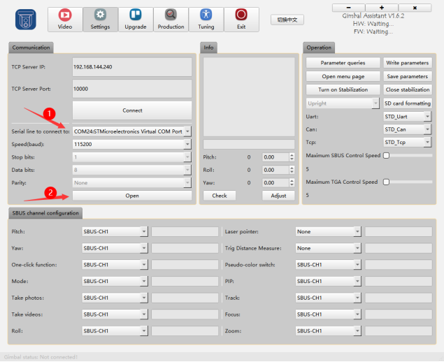
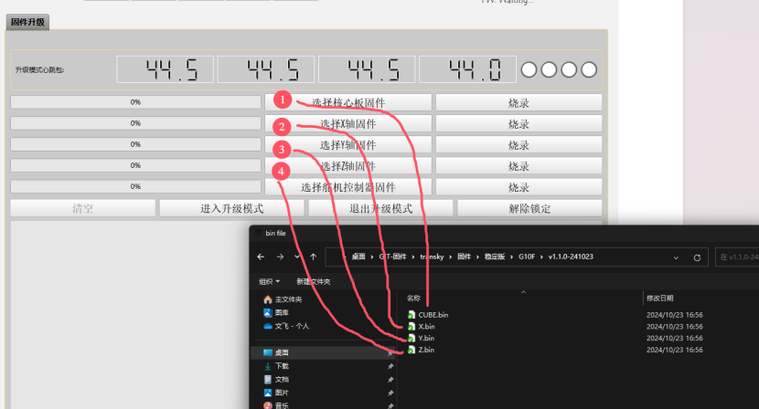

# 云台设置与升级指南

---

## 一、连接云台

### 1. **云台接通电源**

### 2. **TYPE-C插入云台接口**

### 3. **打开TGA，选择对应的串口**  
点击“打开”，参数默认为 `115200 - 8N1`，成功后会出现连接成功的弹窗。

---

## 二、固件升级

### 1. 进入升级模式

### 2. 回到主界面
点击“关闭串口”按钮 --> “打开串口”按钮 --> 进入升级模式

### 3. 选择升级文件
选择要升级的文件。

---

### !!! note "升级提示"
- **`WRITE` 时请等待进度条到达 100% 后再点击“WRITE”下一个。**

**注：**  
- 如果遇到升级失败的情况，请插拔 Type-C 线缆后重新升级一次即可。

### 4. 升级完成  
点击“退出升级”按钮。

---

## 三、重启云台

以上步骤完成后，请断电重启云台，并拔出 TYPE-C 连接线。
